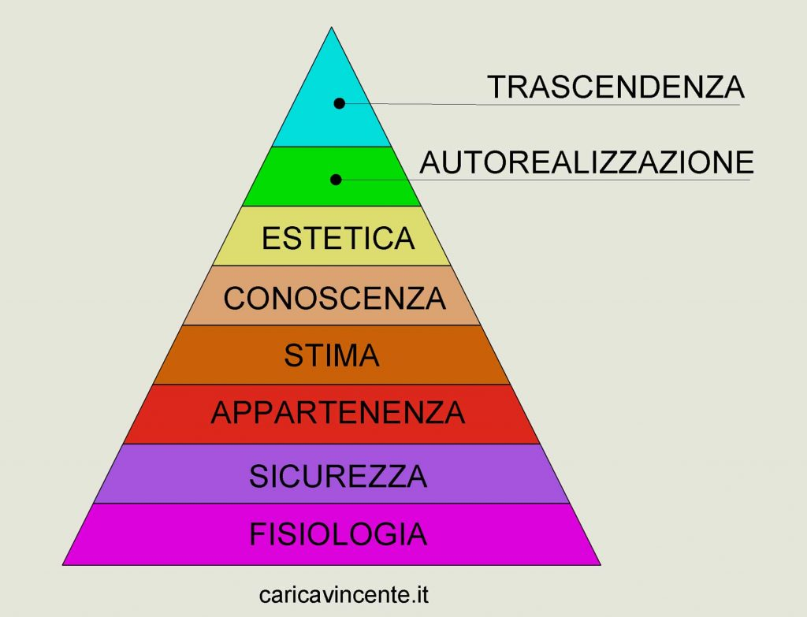
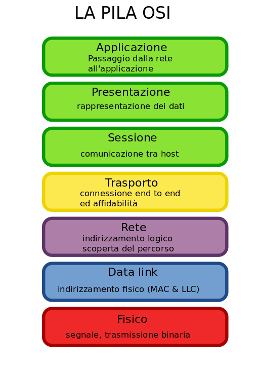
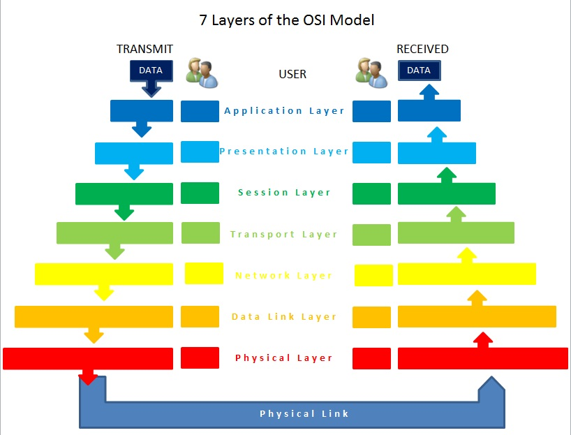

# Centri di rigenerazione territoriale

* Ipotesi di fondi iniettati: 80 milioni di euro in 5 anni

Di seguito presento il concept per un **centro di rigenerazione territoriale** (CRT). Modello che può essere replicato in vari territori e che può essere realizzato gradualmente a partire da quelle risorse e potenzialità che già il relativo territorio ha a disposizione.

Come in ogni aspetto di questo progetto si raccomanda (SHOULD) di procedere con costruttività,  entusiasmo, leggerezza e determinazione. Un buon criterio da seguire è il [Principio di Pareto](https://it.wikipedia.org/wiki/Principio_di_Pareto) che suggerisce che con il 20% dello sforzo si ottiene l'80% del risultato.

## Cosa sono

Sono strutture che facilitano l'aggregazione dei soggetti del territorio, favoriscono l'incontro, il diaologo e la cultura. Per questo hanno carattere multidisciplinare, multigenerazionale e multiculturale. Devono essere luoghi di grande energia ed entusiasmo dovuti:

1. ad educatori/animatori che facilitano l'attività;
2. a partecipanti proattivi, ma non invadenti;
3. ad una architettura ed interni energetici;
4. a regole minimali di rispetto reciproco e costruttività ((e per questo rimando alle 4 componenti dell'Amore secondo Erich Fromm che sono a mio avviso sufficienti));
5. a proposte variegate di attività (in "stile crociera" ;-));
6. alla consapevolezza del bello: nel percorso e nella sperimentazione;
7. alla costruttività e leggerezza: non fare domani quello che puoi fare oggi, ma ciò che non sei riuscito a fare oggi puoi farlo domani;
8. ad andare verso l'alto, al settimo (o maggiore) cielo: ["duc in altum"](http://www.unambro.it/html/pdf/Duc_in_Altum.pdf)! con semplicità e UPAV: un passo alla volta. Prerequisito: credere che sia possibile. Lo è: basta chiedere a chi ci è andato in alto...
  
Sugli esperimenti e gli sperimentatori: chi fa esperimenti sa che la soddisfazione non è nel risultato, ma nel percorso: se si ottiene il risultato previsto bene, se non si ottiene, bene ugualmente perché si può capire quali pregiudizi, mancanze o distrzioni hanno portato ad un risultato differente da quello ipotizzato. Un ripasso del [metodo scienfico di Galileo Galilei](https://it.wikipedia.org/wiki/Metodo_scientifico) che richiede alla base la formulazione di ipotesi nuove e quindi la messa in discussione del cosiddetto "ordine costituito".

## Struttura

*Idea*: a livello di architettura richiedere la consulenza alla [Fondazione Renzo Piano](https://www.fondazionerenzopiano.org)

Immagino che il modello architetturale può essere a piani o a cerchi concentrici, ma sono limitato e perciò vorrei appunto rivolgermi alla Fondazione Renzo Piano o almeno ad architetti del territorio e sicuramente prendere in considerazione come punto di partenza edifici già esistenti.

Ma a livello logico la struttura è piramidale, infatti dobbiamo immaginare l'esperienza di un individuo nel CRT come un viaggio. Ho pensato che il viaggio può essere strutturato su un modello noto e condiviso: [la Piramide dei bisogni di Abraham Maslow](https://caricavincente.it/piramide-di-maslow/). Cito come fonte un articolo di https://caricavincente.it da cui prendo l'immagine di riferimento della piramide strutturata su 8 livelli, in evoluzione dei 5 canonici.

Decido di interpretare questa piramide dei bisogni in senso universale, poiché, almeno nella versione a 5 livelli, questa piramide è conosciuta, condivisa e quindi accettata a livello mondiale. E questo negli anni, quindi non si tratta solo di un fenomeno mediatico, di un hype. Quindi, almeno qui ed ora, la prendo come "blocchetto" funzionante della società. Come verità del mio Adesso.

Piramide dei bisogni dell'uomo, dell'individuo, di una famiglia, di un'azienda, di un'associazione, di una città, della società. Prendiamo un contesto e applichiamola. 

A me piace fare associazioni inconsuete, diverse, #spicy e non banali (#spicynonbanale) perciò prendo come contesto di applicazione e parallelismo il [modello ISO/OSI](https://it.wikipedia.org/wiki/Modello_OSI), comunemente noto anche come **pila ISO/OSI**.

Questo è il più diffuso modello al mondo su cui sono strutturate le reti.

Ogni livello ha una propria responsabilità. 

* La rete che noi chiamiamo **Internet** è fino al livello 3;
* Il **web** è solo una delle applicazioni possibili, quindi livello 7. Oggi la più diffusa: tutto ciò che inizia con https:// o http:// fa parte del web;
* La possibilità e le modalità con cui far dialogare i servizi nelle reti ci è data dal livello 4, ossia il **trasporto di un messaggio** da un punto della rete ad un altro;
* All'interno delle mura domestiche siamo al livello 2, ma questo è un dettaglio... :-)
* Quando vedete i tecnici che bucano le strade o aprono le fogne per far passare cavi, o oggi fasci di fibra ottica, stanno costruendo il livello 1.

### Corrispondenza

| LIVELLO | MASLOW (8 LIV.)  | PILA ISO/OSI  | CENTRO DI RIGENERAZIONE TERRITORIALE                     |
| ------- | ---------------- | ------------- | -------------------------------------------------------- |
| 1       | FISIOLOGIA       | FISICO        | ACCOGLIENZA                                              |
| 2       | SICUREZZA        | COLLEGAMENTO  | ASSISTENZA PROBLEMI QUOTIDIANI                           |
| 3       | APPARTENENZA     | RETE          | BUONA ALIMENTAZIONE E PICCOLA DISTRIBUZIONE ORGANIZZATA  |
| 4       | STIMA            | TRASPORTO     | PRATICHE EDUCATIVE, APPROCCI PEDAGOGICI, SPERIMENTAZIONE |
| 5       | CONOSCENZA       | SESSIONE      | CONFRONTO LIBERO E ASSOCIAZIONI                          |
| 6       | ESTETICA         | PRESENTAZIONE | ARTE, PERFORMERS, RELIGIONE E FILOSOFIA                  |
| 7       | AUTOREALIZZAZIONE| APPLICAZIONE  | SVILUPPO SOFTWARE E ORCHESTRAZIONE TERRITORIALE          |
| 8       | TRASCENDENZA     | APPLICAZIONE  | FA-VOLÀ: just my imagination                             |

Tra gli accostamenti forse il più forzato può sembrare quello tra SICUREZZA e COLLEGAMENTO (o DATA-LINK), ma rilevo che la SICUREZZA come bisogno non ha nulla a che fare con la SICUREZZA informatica. La sicurezza come bisogno è intesa come sicurezza fisica, di salute, di occupazione, morale, di proprietà. Per questo secondo me può trovare corrispondenza con il livello 2 che si occupa del collegamento tra 2 punti di una stessa rete. Mi fermo qui. Se avete osservazioni costruttive e argomentate potete porle tramite le [issues di progetto](https://github.com/feroda/1/issues).

## Come muoversi tra i livelli? Il modello Bell-LaPadula

Per muoversi tra i livelli ho pensato che potremmo ispirarci al [modello Bell-LaPadula](https://it.wikipedia.org/wiki/Modello_Bell-LaPadula) a me arrivato tramite il corso di Sicurezza Informatica all'Università di Bologna sotto la responsabilità del [luminare prof. Ozalp Babaoglu](https://it.wikipedia.org/wiki/%C3%96zalp_Babao%C4%9Flu). 

L'aspetto che mi è venuto in mente nel modello Bell-LaPadula riguarda le tre prorietà di sicurezza (questa volta informatica):

* un soggetto può accedere ad un oggetto solo se il suo livello di sicurezza è maggiore od uguale a quello dell'oggetto. Semplificando: **no read up** (= "Simple Security Property" o "SS-property");
* un soggetto può accedere ad un oggetto solo per operazioni di scrittura se ha un livello inferiore o uguale rispetto all'oggetto. Quindi **no write-down** (= "Star-Property", "*-property" o "S-property");
* è possibile stabilire una corrispondenza (matrice) di accesso discrezionale in modo da assegnare delle **eccezioni nell'autorizzazione** a soggetti specifici (= "Discretionary Security Property" o "DS-property").

Riporto da Wikipedia l'estratto successivo all'elenco delle proprietà: 

"Queste regole insieme servono ad evitare che le informazioni possano propagarsi senza controllo da parte del proprietario, e sono lo strumento per impedire che il sistema possa essere espugnato da un trojan horse (Cavallo di Troia: virus nascosto in un programma che penetra tramite il programma in un computer).

Il trasferimento di informazioni da un paragrafo high-sensitivity a un documento lower-sensitivity può avvenire nel modello Bell-LaPadula per mezzo del concetto di soggetti di fiducia. Subjects di fiducia non sono limitati dalla proprietà.

Un Subject di fiducia deve essere mostrato e testato affinché possa essere dichiarato affidabile in merito alla politica di sicurezza."

### Ma mettendo queste regole non rischiamo di mettere burocrazia e quindi contravvenire allo scopo di semplificazione?

No. Sia perché sono regole che possiamo mettere in discussione e creare occasioni di evoluzione se lo riteniamo opportuno (tramite le [issues di progetto](https://github.com/feroda/1/issues) intanto). Sono regole *software*.

Sia perché essendo appunto regole *software*, sono funzionali ad efficenza, efficacia e, come vedremo bellezza. Per quanto scopriremo che l'armonia della bellezza è in costante evoluzione e quindi l'unica regola che segue è questo costante cambiare, difficilmente quindi "regolabile".

Se parliamo di Amore invece a mio avviso ha delle caratteristiche, ma proprio ha necessità di esprimersi al di fuori delle regole, ma questo è un altro paragrafo e poi... visto che non sono titolato a parlarne e probabilmente ininfluente a livello di progettazione è inefficiente e inefficace approfondire ora, di conseguenza non bello e non #spicy ;-).

Tornando a queste regole del modello Bell-LaPadula, hanno funzionato in vari contesti quindi per ora vorrei testare se possono funzionare per gestire l'accesso e la distribuzione dei messaggi all'interno dei livelli del CRT.

## I livelli del Centro di Rigenerazione Territoriale in dettaglio

*Nota*: preferisco chiamarli "livelli" invece che "piani" per associare al progetto anche lo spirito di *gamification* connaturato.

### LIVELLO 1: ACCOGLIENZA

TODO

### LIVELLO 2: ASSISTENZA PROBLEMI QUOTIDIANI                           

TODO

### LIVELLO 3: BUONA ALIMENTAZIONE E PICCOLA DISTRIBUZIONE ORGANIZZATA  

TODO

### LIVELLO 4: PRATICHE EDUCATIVE, APPROCCI PEDAGOGICI, SPERIMENTAZIONE 

TODO

### LIVELLO 5: CONFRONTO LIBERO E ASSOCIAZIONI                          

TODO

### LIVELLO 6: ARTE, PERFORMERS, RELIGIONE E FILOSOFIA                  

TODO

### LIVELLO 7: SVILUPPO SOFTWARE E ORCHESTRAZIONE TERRITORIALE          

TODO

### LIVELLO 8: FA-VOLÀ: just my imagination                             

TODO

