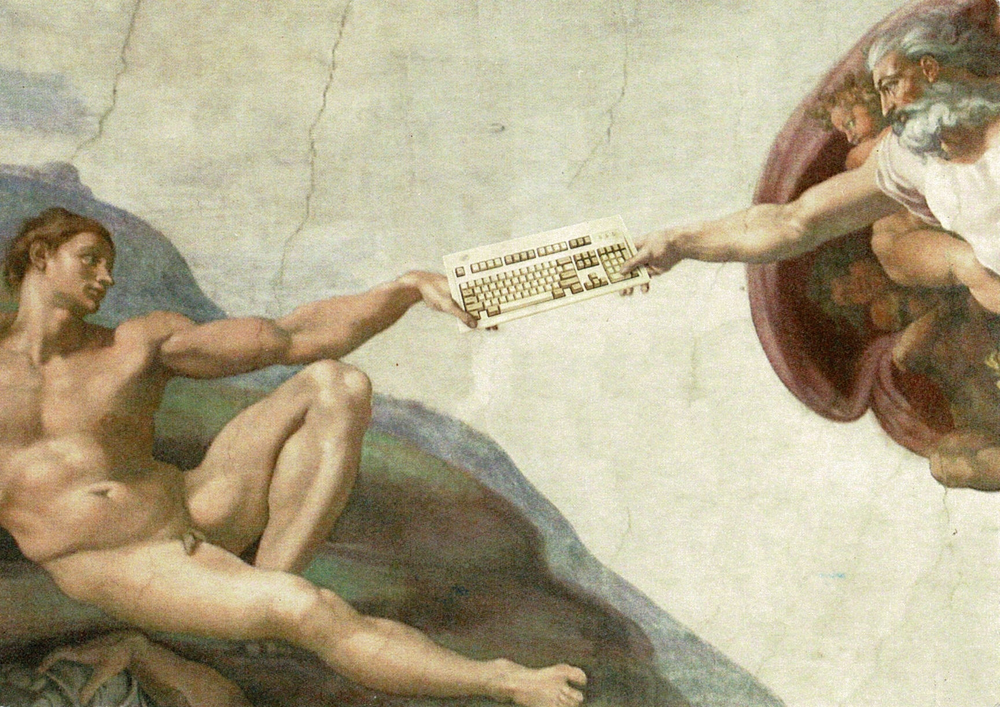

# 1 miliardo per la libertà.

Propongo un progetto open che intende gestire la somma di 1 miliardo di euro per la libertà. Come salvadanaio di riferimento ho avuto la disponibilità da parte del consiglio direttivo del gruppo no-profit di Software Libero PDP di Fabriano https://pdp.linux.it che ringrazio per la fiducia.

## Gli ambiti di iniezione del denaro (*money injection*)

Questo progetto funziona nella logica: "distribuisco denaro a realtà di mia conoscenza diretta in cui so che ci sono le competenze, la determinazione e le pratiche giuste, oltre alla logica open che prevede di mettersi in discussione in modo aperto ogni qualvolta possibile, poiché conveniente".

Tali referenti e realtà verranno pubblicati in questo spazio, ma non ora perché è necessaria la loro autorizzazione esplicita. Non posso infatti sapere se gradiscono questa fantasiosa o meno idea progettuale e se gradiscono esserne collegati.

Nel frattempo scrivo di seguito gli ambiti di distribuzione del denaro, per ognuno di essi ho delle persone e delle realtà di riferimento cui viene assegnato il budget in logica di abbondanza. Loro lo sapranno gestire per lo scopo e anche per rimuovere propri ostacoli e sprechi interni che li rallentano. [Muda](https://it.wikipedia.org/wiki/Muda_(termine_giapponese))

Gli ambiti di attuazione quinquennale e le rispettive cifre che ho ipotizzato in logica di abbondanza sono:

* **Infrastruttura a banda ultralarga e servizi per l'educazione in Italia**. 100,00 milioni
* **Educazione**: portare avanti le migliori pratiche in Italia, oltre a sostenere e attivare percorsi in istituzioni educative preesistenti strategiche per il progetto. 150,00 milioni
* [Centro di Rigenerazione Territoriale](CRT_it.md): ipotizzati 80,00 milioni per una manutenzione quinquennale di spazi, attrezzature, personale, attività. È in realtà un modello che può essere replicato ad libitum;
* **Performers**: implementazione del [progetto LOLA del GARR Consortium](https://www.garr.it/it/comunita/musica-e-arte/lola) in ogni città italiana per supportare concerti e spettacoli professionali remoti, o in presenza quando possibile. 50,00 milioni;
* **IoT for Happiness**: un sistema di monitoraggio per la felicità. Autoregolato, spontaneo e facoltativo, ma conveniente e coinvolgente. 5,00 milioni;
* **Acquisizioni**: acquisire aziende e tecnologie per liberarle. 70,00 milioni;
* **Families care**: un budget per consentire alle famiglie una tranquillità economica in modo che i genitori possano dedicare più tempo per conoscere i propri figli. Accompagnarli in attività costruttive e partecipare. Anche formarsi per questo obiettivo ogni qualvolta possibile. 100,00 milioni;
* **Alimentazione responsabile**, budget per la facilitazione di Gruppi di Acquisto Solidale (GAS) e Piccola Distribuzione Organizzata (PDO);
* **Refactoring Society**, progettazione di una riorganizzazione della società partendo dal presente, non dal futuro. Definire flussi per la sburocratizzazione e scrivere [RFC](https://it.wikipedia.org/wiki/Request_for_Comments) per attuare una *libertà delicata* che tuteli la libertà di ogni individuo fin dove inizia quella degli altri. 5,00 milioni;
* **Play**: sostegno di luoghi per la sperimentazione di una nuova società. 50,00 milioni;
* **Donazioni ad associazioni e progetti amici** che sono state attive a favore della libertà in questi anni. 50,00 milioni;
* **IoT per il clima**: non abbiamo dati aperti, *open data*, relativi al clima. Sosteniamo lo sviluppo di stazioni climatiche a basso costo da proporre almeno agli 8.000 comuni d'Italia. 5,00 milioni;
* **Confronto su temi scottanti**. Ci sono temi che generano non solo dibattito, ma anche impegno, ricerche e tempo dedicato da tante persone nel mondo. Sia quelli che condividono la visione più diffusa, sia quelli che non la condividono. Si intende restringere il dibattito in tavoli di confronto tra professionisti ed esperti dell'una e dell'altra parte in modo da facilitare il confronto e il dialogo. In questo modo si isoleranno una serie di punti in accordo e una serie di punti in disaccordo e ci si potrà aiutare intanto su quelli in accordo e valutare nel percorso gli ulteriori sviluppi. Dando priorità ai temi che hanno maggior impatto nel quotidiano, il 5G su tutti direi come esempio. 5,00 milioni; 
* **Retribuzione a vita per "world class" benevolent people**: ci sono varie persone che hanno dimostrato di agire nell'interesse dell'umanità ogni giorno, l'idea è di costituire un fondo per il loro vitalizio e lasciare che proseguano nella loro attività, loro energia. 10,00 milioni;
* **Retribuzione dello staff di questo progetto**. In logica open, si aggregano di solito molte più persone costruttive di quante se ne possano immaginare all'inizio del progetto. È bene che le persone che rimuovono i problemi possano esprimere la loro giornata lavorativa con questa creatività e pragmatismo. 10,00 milioni;
* **Pianoforte grandcoda**. ci vuole un po' di stile... e arte! 120.000,00 euro
* **Una manciata di auto elettriche, biciclette e monopattini elettrici**. 500,000 euro... certo... manca il Jet... però... sai mai che qualcuno lo possa dare in usufrutto quando serve ;-)

### Nota sulle cifre e loro distribuzione

A me sinceramente sembra che le cifre associate siano più che abbondanti, ma sempre a dire il vero non ho mai gestito un progetto di questa portata e preferisco ragionare per ordini di grandezza lasciando poi alle persone competenti di ragguagliarmi sulle opportunità di ampliamento o restrizione. Il progetto è software, quindi non è mai tardi per aggiustare dei caratteri nel documento ;-)

Come vedrete, il MILIARDO è un'idea, un faro. In realtà ce lo possiamo dare come obiettivo, ma con poco denaro abbiamo già fatto molto in questi anni. Il punto è: quanto vogliamo #accelerareilbello ? ;-)

Per le somme donate all'associazione [PDP Free Software User Group di Fabriano](https://pdp.linux.it) siamo facilitati perché sono esentasse e quindi possiamo utilizzare l'intero budget posto che rispettiamo le finalità statutarie.

## Descrizione

Il mio interesse non è tanto che una singola realtà ottenga 1 miliardo di euro, sarebbe buono e comodo, efficiente ed efficace, ma non cambia nella sostanza se effetivamente io, come autore di questo progetto, avessi la possibilità di far circolare una abbondante somma di denaro appartenente anche ad altre realtà. Chiaramente sarei aiutato da uno staff di fiducia di persone fantastiche che mi hanno supportato e sopportato in questi anni e altre che ne incontrerò, ma ora mi rendo conto che non posso impegnarle in questa altra idea che è solo mia, finché non si concretizzerà ed espanderà luce.

Questi fondi verranno distribuiti per dare sostegno ad ambiti e persone che già oggi operano al meglio delle proprie forze per realizzare un futuro compatibile a quello definito nell' [art. 3 dello Statuto dell’associazione](assets/doc/PDP_Statuto_2003.pdf). 

In questo modo intendo ridurre asintoticamente a zero le burocrazie, facendo in modo che le persone che lavorano in questi ambiti siano facilitati e alleggeriti, perché oggi rappresentano il presente e il futuro della società interpretandone i nuovi valori di fratellanza, rispetto e creatività. 

Il progetto è rivolto a tutti, ma chiaramente gli output, i *deliverable*, sono più per i giovani, come dovrebbe essere ogni progetto furbo e realista, poiché sono loro a costituire il presente e il futuro di questa società. Ma i soldi li chiedo più che altro "ai vecchi" che so essere anche saggi ;-)

Intendo accelerare il bello, "prima che ce li giochiamo tutti" questi giovani, perché oggi vedo troppo spesso un popolo adulto che trasmette pesantezza e complicazione
invece che speranza, leggerezza, determinazione ed allegria. Io stesso troppo spesso l'ho fatto, ma oggi decido di non essere complice di questa parte di me.

Ragiono come in un gran bel film e rivolgo un invito a tutti gli uomini e le donne dei popoli liberi: **"testimoniamo di nuovo la capacità dell'uomo e della donna di risolvere i problemi insieme"**.

Non si tratta infatti solo di mera distribuzione dei fondi, ma anche di implementazione di [pratiche Agili](https://agilemanifesto.org/iso/it/manifesto.html) e di Lean Manufacturing volte a sperimentare concretamente un’evoluzione del [sistema economico](https://it.wikipedia.org/wiki/Economia) basato sulla [felicità](https://it.wikipedia.org/wiki/Felicit%C3%A0_interna_lorda), sul [lavoro](https://it.wikipedia.org/wiki/Lavoro), e sulla valorizzazione delle persone, del tempo, della cultura e dell’arte. Nel fare ciò si riutilizzeranno spazi, risorse e tecnologie, implementando ciò che si riterrà necessario.

Il progetto intende sostenere una visione della società allegra e positiva, spiritosa, ma mai banale. Intende inoltre valorizzare, ringraziare ed aggregare chi già porta questi valori oggi in questa società che sembra disperata, ma vi assicuro che negli occhi dei giovani non lo è. Anzi è semplice. Io in mezzo ai giovani ci sto, e li vedo i loro occhi.

Diciamo che se io fossi un *policy maker* europeo destinerei 1 miliardo degli 800 previsti dal [programma Next Generation EU (volgarmente noto come Recovery Plan)](https://ec.europa.eu/info/strategy/recovery-plan-europe_it) a Luca Ferroni ;-) per vedere se questa sperimentazione può effettivamente costituire un modello evolutivo per l'economia e l'educazione.

E per quanto mi sarà possibile, vorrei che glielo facessimo sapere a queste personce che c'è qualcuno che pensa fuori dagli schemi c'è. Gli hackers della società ci sono e hanno fatto molto per aiutare questo mondo ad essere facile e bello. Per noi lo è. Di solito lo è quando ci lasciate fare a modo nostro per aiutarvi.

[IoRestoACasa.work](https://iorestoacasa.work) sarà solo un granello, ma [è stato messo in piedi in 3 giorni](https://iorestoacasa.work/rassegna-stampa.html) e dopo 2 settimane avevamo server distribuiti in tutta Italia, con Software Libero, per 200GB di banda e una community di 70 tecnici specializzati. Ora [la chat Telegram conta 401 membri](https://t.me/iorestoacasawork), non siamo più solo tecnici specializzati, ma si sono unite tante belle persone. Motivate verso la libertà.

Proporrò [1 miliardo per la libertà](https://github.com/feroda/1) anche a "[The Economy Of Francesco](https://francescoeconomy.org/it/)" o altri progetti e chi desidera spingerne una parte potrà farlo, ma nella consapevolezza che io non potrò fare molto di più che dare il massimo per rendere bella questa tavola che sto apparecchiando. Come ogni progetto OPEN, chi intende aiutare si potrà dare da fare per rimuovere i problemi al progetto con le proprie competenze e così facilitarlo, non creare barriere o perdite di tempo. Accelerare. Fail fast. Altrimenti non funziona.

Se io stesso scoprirò che questo progetto è una barriera, farò dietro front, e lo chiuderò, come ogni progetto OPEN non necessario, ma i miei occhi e le mie orecchie non vedono o non sentono parlare di speranza, concretezza, pragmatismo, semplicità. Quasi esclusivamente di sovrastrutture inutili. Loop del cervello. Lo so perché ci sono passato. Non mi sono mosso da questo loop per almeno 9 anni, ma ora eticamente non posso più lasciare che queste dannate nuvole rallentino la creazione del bello.

Perché in 18 anni il mondo, da che abbiamo fondato il PDP Free Software User Group, si è spostato sui fronti su cui è stato impostato, quindi è ora di accettare completamente la responsabilità di questo presente e mostrarne le potenzialità che forse nessuno ha compreso fino in fondo. Non posso saperlo. Non possiamo. Proviamoci.

Sicuramente non si concretizzerà esattamente come io lo immagino ora, ma anche solo se avrò fatto lo 0,01% di quanto scriverò qui lo avrò fatto perché lo ritenevo giusto, e come si suol dire nei migliori film, per i nostri figli, e i figli dei nostri figli.

Sinceramente in cuor mio credo che questo 0,01% l'ho già fatto perché il progetto è una prosecuzione del mio percorso, una sua evoluzione, maggior fiato alle attività da me iniziate, e a volte non finite, ma mai abbandonate. Nel cuore, nella testa, nelle gambe. 

Sono [Luca Ferroni](https://www.lucaferroni.it) e ho già fatto tanti danni, tante cose appese che possono continuare a vivere prendendo una forma sempre più bella se le persone che ne sono parte le ritengono utili e degne. O di essere chiuse. In ogni caso come belle storie meritano un finale.

Il progetto è rilasciato con licenza di Software Libero GNU AGPLv3 per opportunità del portale [GitHub.com](https://github.com) su cui è al momento pubblicato. Si tratta di un progetto per lo più documentale pertanto si aggiunge una ulteriore licenza Creative Commons Attribution 4.0 internazionale: https://creativecommons.org/licenses/by/4.0/deed.it 

Diamo un calcio all'impossibile. Baden Powell ha fatto molto, tanti altri hanno fatto e fanno molto, aiutiamoli ad aiutarci. Aiutiamoci. 

1 come... 

* "1 non tradirla mai ha fede in te" - [Gianni Morandi, Un mondo d'amore](https://youtu.be/2c_xoz1gCgU)
* "One Love, One Life" - [U2, One](https://youtu.be/ftjEcrrf7r0)
* "I hope some day, you'll join us, and the World can live as One" - [John Lennon, Imagine](https://youtu.be/EJ72bYyEtBg)

Fabriano, 1 agosto 2021

Luca Ferroni, 
... una faccia che buca lo schermo. E non posso dirvi in che modo, ma ci riuscirà. Punto. E virgola.

Posso però dirvi come ci sono riuscito in altri progetti ;-) ...e anche come sarà il finale ;-)

*Io ad alta risoluzione solo testa* - Bologna, nel 2009 circa... qualche anno fa!

*La creazione di Adamo 2.0*, scansione di una cartolina acquistata al [FOSDEM - Free and Open Source Developers' European Meeting](https://fosdem.org) di Bruxelles

Citazione di Osho sulla creatività, scansione del libro *diecinumeriperconosceredio* di [Umberto Verdirosi](http://www.umbertoverdirosi.it/)

## Come contribuire

Se sei arrivato/a a leggere fin qui probabilmente il progetto ti ha suscitato un certo interesse e potreste decidere di voler contribuire fin da ora.

Segui le brevi indicazioni in [CONTRIBUTING_it.md](CONTRIBUTING_it.md) per capire cosa puoi fare oggi.
